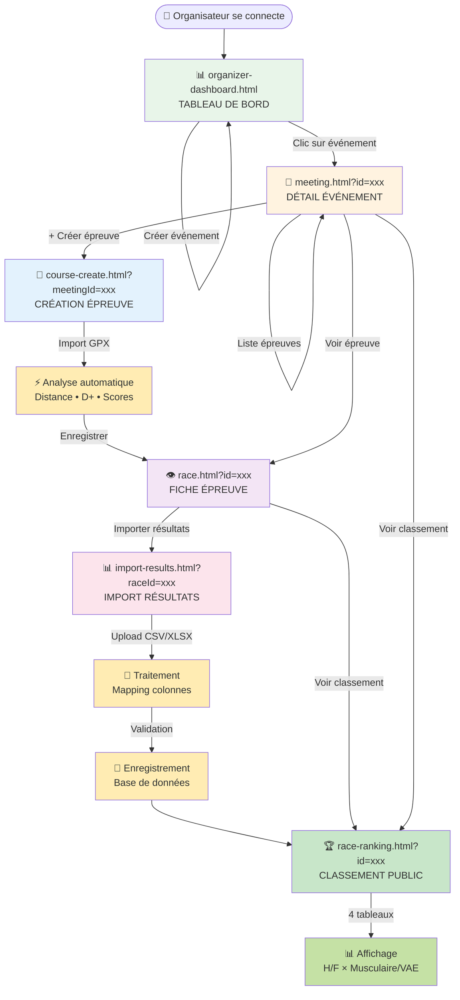

## Légende des couleurs

- 🟢 **Vert clair** : Tableau de bord (point d'entrée)
- 🟠 **Orange** : Gestion événement
- 🔵 **Bleu** : Création épreuve
- 🟣 **Violet** : Détail épreuve
- 🔴 **Rose** : Import résultats
- 🟢 **Vert foncé** : Classement public

## Navigation rapide

| Page | URL | Rôle |
|------|-----|------|
| Tableau de bord | `organizer-dashboard.html` | Point d'entrée organisateur |
| Événement | `meeting.html?id=xxx` | Hub central d'un événement |
| Création épreuve | `course-create.html?meetingId=xxx` | Formulaire + GPX |
| Fiche épreuve | `race.html?id=xxx` | Détails complets |
| Import résultats | `import-results.html?raceId=xxx` | Upload CSV/XLSX |
| Classement | `race-ranking.html?id=xxx` | Vue publique |
